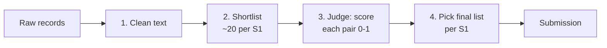

# Entity Resolution Solution Spec

Sep 25, 2026 · @Anant

## 1. The problem in plain words

For each of 1.73 million test businesses in Source 1 (S1), we must list which of about 10 million messy records in Sources 2 and 3 (S2/S3) describe that same business. The list can be empty.

A real example from the training data:

| Source | Name | Address |
| --- | --- | --- |
| S1 (the clean reference) | Naini Cyber Limited | 406 Udyog Vihar Phase Iii, Gurgaon, Haryana |
| S2 match | Sri Naini Limited Cyber | DOOR NO 0406 UDYG VIHAR PHASE III, GURGAON, Haryana |
| S2 match | NAINI  CYBER LIMITED | #0406 UDYOG VIHAR PHASE III, GURGAON, Haryana |
| S3 match | M/s Naini Limited Cyber | HR, 406 Udog Vihar Phase Iii, Gurgaon |
| S3 match | Naini Cybbre Limited | 406 Udyog Vihar Phase Iii, Gurugram, Gurgaon, HR |

The right answer for this S1 is those 4 IDs. A human sees it at once, but the records differ in word order, spelling, typos, house-number format and state names. We must do this 1.73 million times, against 10 million records, automatically.

**How we are scored.** For each S1 we compare our list with the true list, using F0.5 (precision counts double). Then we average over all S1s.

- A wrong ID in our list hurts more than a missed one. True {a}, we say {a, x}: 0.56. True {a, b}, we say {a}: 0.83.
- If the true list is empty and we say empty, we get 1.0. If we add anything, we get 0.

We also have **training data**: 2.2 million S1s from the US and India with their correct lists. Test adds **France**, which has no training examples at all.

## 2. What the data taught us

We measured the real training data before designing anything. Each fact below changes one design choice.

| Fact (measured) | What it means for the design |
| --- | --- |
| Only 5.6% of S1s have no match; the rest have 3.5 on average (up to 11) | Finding most of each list matters more than being shy. An all-empty answer scores only 0.056. |
| Every S2/S3 record belongs to at most one S1 (true for all 7.64M) | If a record fits two S1s, we give it only to the better one. This removes many wrong IDs for free. |
| No match ever crosses countries | We only compare US with US, India with India, France with France. |
| About 26% of S2/S3 records match no S1 at all | These are decoys. The system must be allowed to say "this record belongs to nobody". |
| 12–24% of India S2/S3 names are in Hindi, Telugu, Tamil and other scripts (`हरि फाउंडेशन प्राइवेट लिमिटेड`) | We convert them to Latin letters before comparing ("hri phaundesn praivet limited"), and lean on the address, which stays in English. |
| 1–3% of true matches have a made-up name (`UMBRATAVO`) and 4–5% have an empty address | Name and address must each be able to carry a match alone. |
| House numbers are noisy: `0406`, `#406`, `DOOR NO 406`, `1490` becomes `490` | We compare house numbers by closeness, not exact equality. |
| France: many different businesses on the same street ("Locataires ... SARL" at 12 and at 27 Rue de l'Avenir) | France is the main risk of wrong matches. House number and the full name must both agree. |

The full list of noise types we found is in `NOTES.md` in the project folder.

## 3. The solution, step by step

Comparing every S1 with every S2/S3 record would be 1.7M × 10M = 17 trillion pairs, which is impossible. So we work like a hiring funnel: a cheap filter finds a shortlist, then a careful judge scores only the shortlist.

**Step 1: Clean the text (plain code, no model).** Make every record comparable. For example, `#0406 UDYOG VIHAR PHASE III, GURGAON, Haryana` becomes `406 udyog vihar phase iii gurgaon haryana`. Rules: lowercase, remove accents, convert Hindi or Telugu to Latin letters, turn `Road` into `rd`, strip `M/s`, `Sri`, `---`, split out the legal form (`Pvt Ltd`), and pull out the house number. Many rules are learned from the training pairs themselves (for example we found `maharashtra ↔ mh` 3,991 times).

**Step 2: Shortlist (search, not learning).** For each S2/S3 record, find the \~10–20 most similar S1 records in the same country. "Similar" means sharing many short letter chunks (`nai`, `ain`, `ini`...), weighted so rare chunks count more. This is the same idea a search engine uses (TF-IDF). We run it separately on the name, the address, and both together, plus a few exact keys such as "same house number and same rare street word". We merge all results into one shortlist.

The shortlist sets a hard ceiling: a true match that is not shortlisted can never be found later. Our target is to keep at least 98% of true matches in it.

**Step 3: Judge each pair (the machine-learning model).** For each shortlisted pair (S1, candidate) we compute about 60 numbers that describe how alike they are, then a trained model turns them into a probability of being the same business. Details in section 4.

**Step 4: Pick the final list for each S1 (a decision rule, no training).** Using the probabilities:

1. Each S2/S3 record goes only to the S1 it fits best, because a record never belongs to two S1s.
2. For each S1, sort its candidates by probability, then try "keep the top 0, top 1, top 2..." and choose the count that gives the highest expected score. Example: probabilities 0.9, 0.5, 0.3 → keeping just the top one scores best (0.79), because the 0.5 one is as likely wrong as right, and a wrong one costs more than a missed one.

## 4. The models: what they are, what they learn from

The core judge is one LightGBM model. Up to three neural models are added later only if they measurably help, and each feeds the judge rather than replacing it.

### 4.1 How the training examples are made

This is the same for every model. We run steps 1–2 on the **training** data, which gives about 20 shortlisted candidates per S1, so roughly 40 million (S1, candidate) pairs. Each pair gets a label from the answer key (`train_ground_truth.tsv`): **1** if the candidate is in that S1's true list, otherwise **0**.

- About 7.6 million pairs are 1 (true matches).
- The rest are 0. These are useful "hard" negatives: records that look similar but are different businesses, such as the same chain name at another address.

We train on the same kind of pairs we will see at test time. For fast experiments we use a 25% sample of S1s (about 10 million pairs).

### 4.2 Model A: LightGBM judge (always used)

- **What it is:** gradient-boosted decision trees. Many small if-then trees vote, for example "if the name similarity is above 85 and the house numbers agree, then likely a match". It trains in minutes on CPU and is the standard winner on table-like features.
- **Input:** about 60 numbers per pair, for example:
  - name similarity scores (edit distance, word overlap, similarity after reordering words)
  - address similarity scores
  - house number: agree / conflict / missing, plus how close the numbers are
  - does the pair share a *rare* word ("zydus") or only common ones ("traders")?
  - legal form: agree / conflict / missing
  - flags: name looks made up, address empty, name was in Hindi or another script, record came from S2 or S3
  - competition: is this the best candidate for this S1, and is this S1 the best owner for this record? By how much?
- **Output:** probability that the pair is the same business.
- **Training:** 5 rounds; each round holds out 20% of S1s, trains on the rest, and predicts the held-out part. This gives honest predictions for every training pair, which we use to measure the score and to calibrate the probabilities.

### 4.3 Model B: multilingual cross-encoder (upgrade, GPU)

- **What it is:** a small transformer language model that reads both records as text side by side, e.g. `Naini Cyber Limited | 406 Udyog Vihar... [SEP] नैनी साइबर लिमिटेड | #0406 UDYOG VIHAR...`, and outputs one match score. It understands Hindi and French directly, and catches patterns our hand-made features miss.
- **Candidates:** `Qwen/Qwen3-Reranker-0.6B` (Apache-2.0) first; `microsoft/mdeberta-v3-base` (MIT) as a lighter fallback.
- **Trained on:** a few million pairs from 4.1, about 1 true match to 2 hard negatives, with the same 5 held-out rounds. 1–2 epochs on one A5000.
- **Used as:** one extra input number for LightGBM.

### 4.4 Model C: embedding model for the shortlist (upgrade, GPU)

- **What it is:** a model that turns each record into a list of numbers so that similar businesses land close together, even across scripts, where letter-chunk search fails.
- **Candidates:** `Qwen/Qwen3-Embedding-0.6B` (Apache-2.0) or `intfloat/multilingual-e5-base` (MIT).
- **Trained on:** the 7.6M true pairs ("pull these two together"), half shown in the original script and half converted to Latin.
- **Used as:** an extra shortlist source in step 2. It is added only if it raises the share of true matches kept.

### 4.5 Model D: small LLM for hard cases (optional, last)

`Qwen/Qwen3-4B` (Apache-2.0), fine-tuned to answer "same business? yes/no" only for the 5–10% of pairs where LightGBM is unsure (probability 0.3–0.7). Its answer is another input to LightGBM.

**Rules check:** every model is MIT or Apache-2.0 and under 8 billion parameters. No outside data is used; all training comes from the provided files.

## 5. How we know it works

We trust our own held-out score, not the public leaderboard. The leaderboard scores only part of the test set, so it is noisy.

- **Held-out score:** the 5 rounds in 4.2 give a prediction for every training S1 from a model that never saw it. We compute the exact competition score on these, split by country and by "has matches" vs "no matches".
- **Shortlist check:** the share of true matches that survive step 2 (target at least 98%).
- **One change at a time:** every experiment is logged in `experiments.md`. A change stays only if the held-out score goes up.
- **Look at mistakes:** after each change, read 25 wrong matches and 25 missed matches, and label why each happened. The most common cause is fixed next.

**France, which has no training examples.** We can't measure France directly, so we use stand-ins:

1. **Country swap test:** train on US only and score India, then the reverse. A feature that helps normally but hurts this test has learned something country-specific, so we drop it.
2. **Country-neutral features only:** similarities, agree/conflict flags and ranks mean the same thing in any country. No "is this India?" input.
3. **French cleaning rules:** `R.`/`RUE`, `BD`, `N°`, `BIS`, department vs region, `SARL`/`S.A.S.`/`EURL` at the front of names.
4. **Fake French matches:** apply the noise types we found in training to French test S1 records, which creates pairs we know are matches. It uses no labels, and checks that the model separates French matches from French look-alikes.
5. **Sanity monitor:** compare French predictions with US/India, such as the average list size and the share of empty lists. A big gap points to a cleaning or shortlist bug.

## 6. Why a baseline first, and not the final system directly

The baseline *is* the first version of the final system. It is not a throwaway. It has all four steps end to end, but each step is the simple version: basic cleaning, text-search shortlist, LightGBM with about 20 features, and the decision rule. The final system is that same pipeline with better parts swapped in.

We build it first for four reasons:

1. **It tells us where the points are lost.** Without a working pipeline we can't tell if the shortlist, the judge or the decision rule is the weak link. For example, if the shortlist keeps only 90% of true matches, a better neural judge is wasted effort; the fix is the shortlist.
2. **It gives the yardstick.** Every upgrade (cross-encoder, embeddings, LLM) costs GPU hours. We add one only if it beats the baseline's held-out score. Otherwise we can't tell a real gain from a feeling.
3. **It catches plumbing bugs early.** At 10 million records, most failures are boring: running out of memory, wrong file format, a missing S1 row. The official validator rejects the whole file for any of these. Finding them on day 1 is cheap; finding them on the last day is fatal.
4. **There is always a valid submission.** If time runs out, we still submit something that scores well.

Going straight to the "ultimate" system means training a GPU model for hours before knowing whether the shortlist even contains the answers. In published competition write-ups, the winning systems were almost always a strong feature-based model first, with neural models stacked on top later. The ultimate system is the destination; the baseline is the first working stretch of the same road.

## 7. Build order

Each milestone ends with a measured score, and the next one starts only after that.

| # | Milestone | Done when |
| --- | --- | --- |
| 1 | Data study (done) | Noise types and key facts written in `NOTES.md` |
| 2 | Baseline: all 4 steps, simple versions, 25% sample | Held-out score logged; first submission passes the validator |
| 3 | Better shortlist: more search views, Hindi-to-Latin conversion, house-number keys | At least 98% of true matches kept, with about 20 candidates per S1 |
| 4 | Full judge: \~60 features, calibration, one-owner rule | Held-out score and country-swap score both beat milestone 2 |
| 5 | France hardening: French rules, fake French matches, monitor | French predictions look like US/India; country-swap score holds |
| 6 | Cross-encoder (Model B), then embeddings (Model C) if the shortlist still misses matches | Each is kept only if it raises the held-out score |
| 7 | Freeze: full-data run, final package, documentation | Clean rerun from scratch reproduces the submitted files |

**Open question for you:** when is the deadline? It decides whether milestones 6 and the optional LLM fit in.
